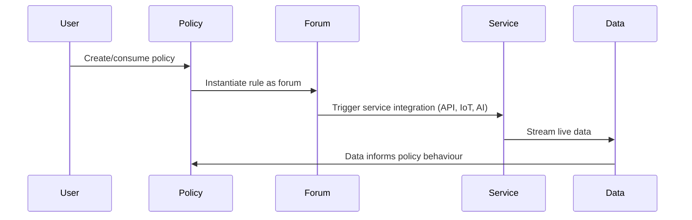
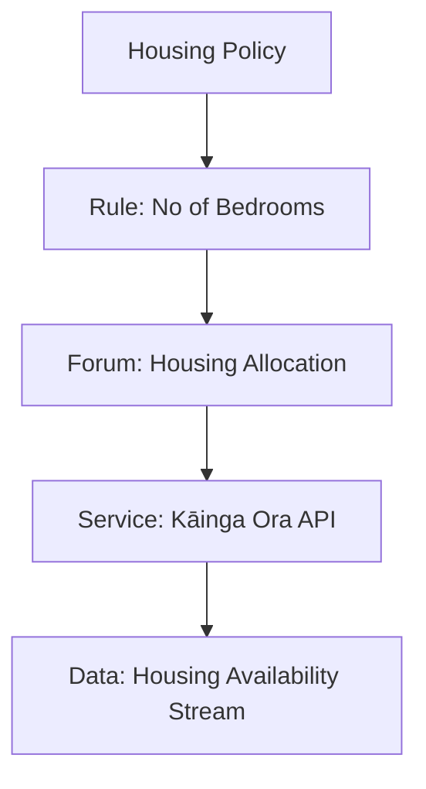

# Eleutherios Architecture Overview

This document describes the high-level architecture of the **Eleutherios MVP** and its evolution.  
It builds on the Firestore schema (see `SCHEMA.md`) by explaining runtime flow, API integrations, and future directions.

---

## Core Layers

Eleutherios implements four interconnected layers:

- **Policy Layer**  
  The atomic unit of governance. Defines rules, structure, and references to forums, services, or nested policies.

- **Forum Layer**  
  Rules instantiated into stakeholder interaction spaces. Can also reference policies or services.

- **Service Layer**  
  APIs, IoT devices, AI agents, or business processes connected to forums and policies.

- **Data Layer**  
  Underlying information streams from services, feeding into policies and forums dynamically.

---

## Runtime Flow

---

## API & Backend Integration

- **Firebase/Firestore** → document storage, real-time sync, triggers for rules → forums.  
- **Cloud Functions** → recursive breadcrumb building, policy nesting resolution.  
- **Service APIs** → housing registries, health records, food distribution systems, IoT sensors.  
- **AI Integration** → policy editing prompts, automated rule instantiation, semantic search.  

---

## MVP Social Housing Example

---

## Future Direction: Eleutherios as IAAS

Longer-term, Eleutherios evolves beyond SaaS or PaaS into an **Infrastructure-as-a-Service substrate**, effectively a **decentralised operating system**.

- **Policies as primitives** → even OS functions defined as policies.  
- **Protocol standard** → Policy–Forum–Service–Data becomes a global protocol.  
- **Hardware integration** → microchips embedding the protocol for policy-native computation.  
- **Full-stack governance** → from analogue (human, cultural) to digital (machine, IoT, AI).  

---

## Notes

- **Prior Unity Principle**: Every layer resolves back to Policy, ensuring coherence.  
- **Circular Reference Protection**: Policies cannot reference themselves directly.  
- **Extensibility**: New services and data sources can be attached at runtime.  
- **Scalability**: Architecture supports infinite policy nesting (like a tree of life).  
