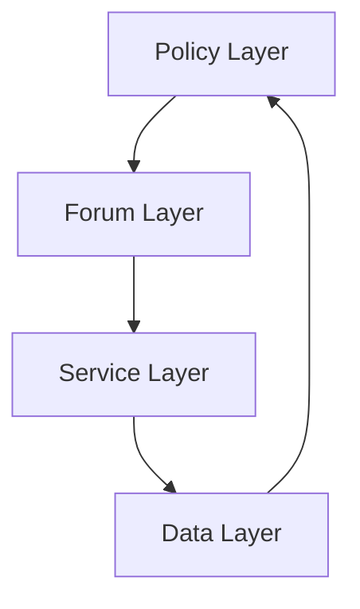
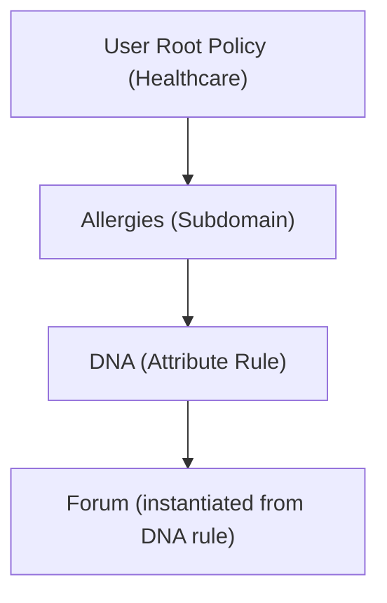
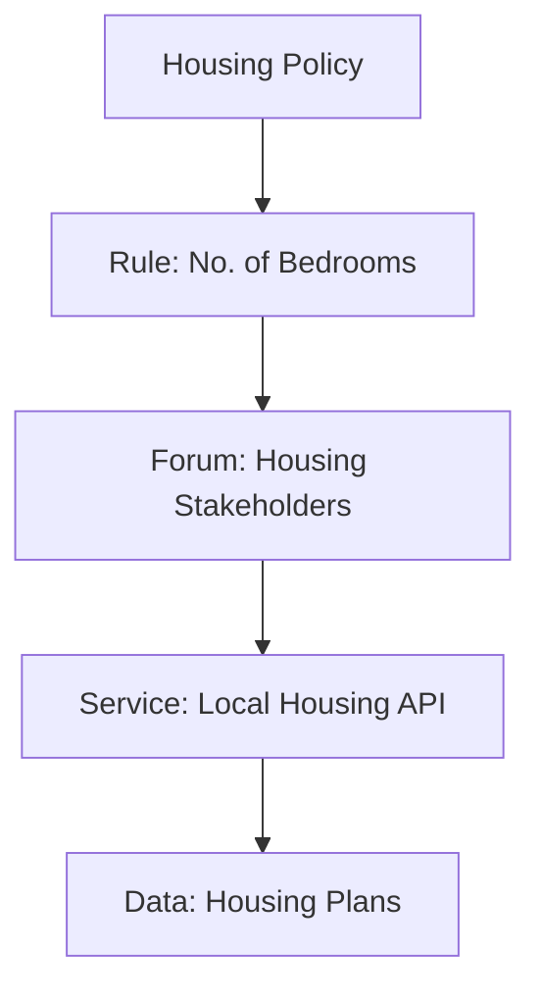
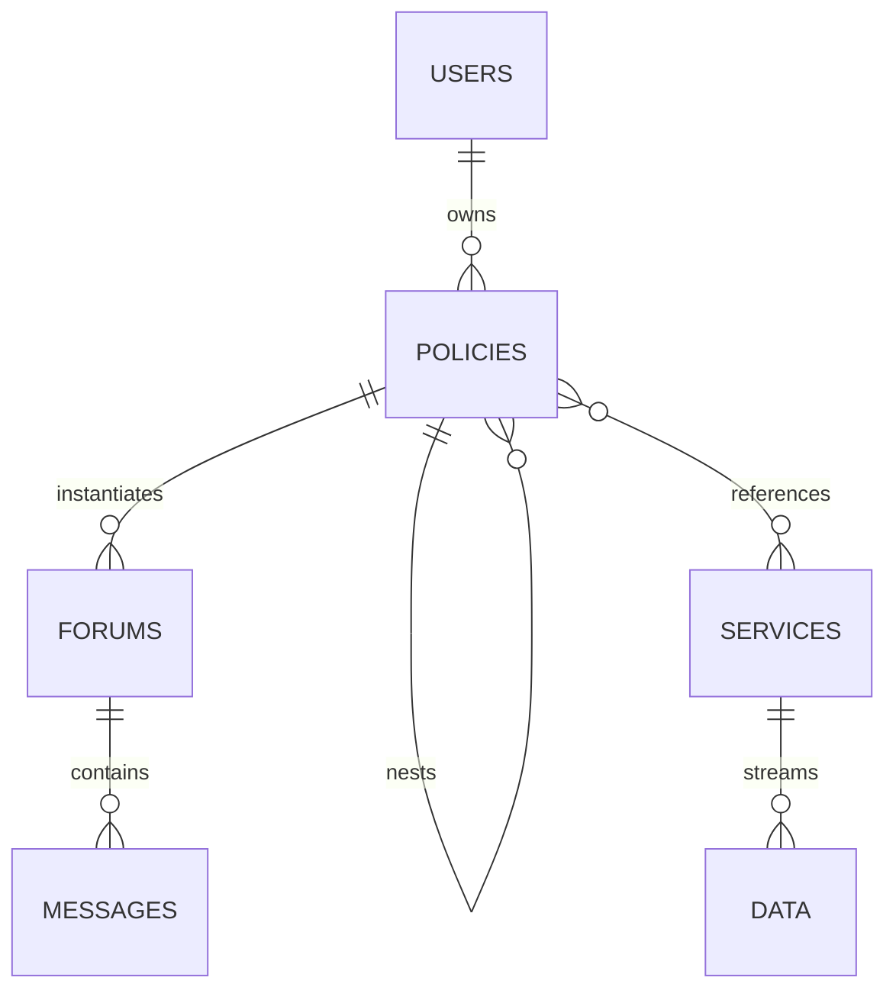

# Eleutherios Firestore Schema

This document describes the initial Firestore schema for the **Eleutherios MVP**.  
The architecture is based on the **Policy → Forum → Service → Data** model, where all entities are policies or derived from policies.

---

## Collections Overview

- **Users**  
  Each human or non-human actor with a root policy.  
  `/users/{userId}`  

- **Policies**  
  Atomic governance unit. Can nest other policies, or instantiate rules into forums.  
  `/users/{userId}/policies/{policyId}`  

- **Forums**  
  Instantiated discussions or rule containers. May point back to a policy.  
  `/users/{userId}/policies/{policyId}/forums/{forumId}`  

- **Services**  
  APIs, IoT, AI, or business processes attached to policies.  
  `/services/{serviceId}`  

- **Data**  
  Underlying information streams exposed by services.  
  `/services/{serviceId}/data/{dataId}`  

---

## Visual Diagrams

### 1. Core Layers

---

### 2. Nested Policy Example

---

### 3. Service Consumption

---

### 4. Overall Firestore Shape

---

## Notes

- **Circular references** are prevented (policy cannot reference itself).  
- **Breadcrumbs** are materialised for navigation and auditing.  
- **Triggers** allow rules to instantiate dynamically from events (IoT, cron, AI).  
- All entities resolve back to **Policy** as the atomic unit.
