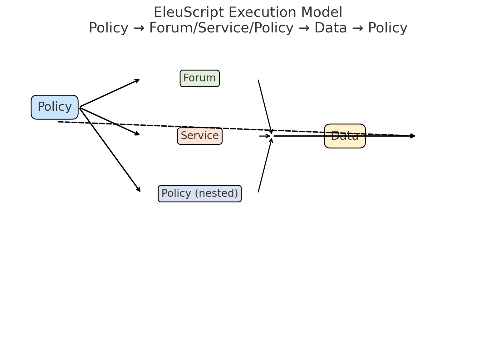

# EleuScript Specification

EleuScript is the domain-specific language (DSL) for defining **Policies**, their **Rules**, and how those rules instantiate Forums, Services, or other Policies when consumed.

It provides a programmable way to express the **Policy–Forum–Service–Data (PFSD)** architecture of Eleutherios.

---

## Core Concepts

- **Policy**: Root object in EleuScript (like `class` in OOP).  
- **Rule**: Directive inside a Policy. Each Rule can point to:
  - A Forum (instantiated space for stakeholders).  
  - A Service (API, IoT device, human, AI, payment provider).  
  - Another Policy (nested governance).  
- **Consumption**: Rules are not executed until a Service consumes the Policy.  
- **Stakeholders**: Entities (human or non-human) participating in Forums or Services.  
- **Permissions**: Default and customizable actions stakeholders can take (see `schema.md`).

---

## Example Syntax

```eleuscript
policy HousingPolicy {
  rule TenancyAgreement -> Forum("Tenancy Forum", defaultStakeholders = ["Tenant", "KO"])
  rule RentPayment -> Service("StripePayment", currency="NZD")
  rule IdentityVerification -> Service("RealMeAuth")
}
```

**Notes:**  
- Rules are *declarative*. Nothing runs until a Service consumes the Policy.  
- Forums auto-populate with default stakeholders.  
- Services connect to external or internal systems.  

---

## Execution Model

1. **Define Policy** in EleuScript.  
2. **Rules declared** (Forum, Service, or nested Policy).  
3. **Consumption** by a Service instantiates the rules.  
   - If Forum → creates a live collaboration space.  
   - If Service → executes API/IoT/Human process.  
   - If Policy → points to existing or creates new Policy at runtime.  

---

## Diagram



---

## Permissions (Forum Stakeholders)

When a stakeholder is added to a Forum, defaults apply:

- Add stakeholder/service [Yes|No]  
- Remove stakeholder/service [Yes|No]  
- Create sub-forum [Yes|No]  
- Post message [Yes|No]  
- Remove own message [Yes|No]  
- Remove others’ messages [Yes|No]  
- Upload file [Yes|No]  
- Remove own file [Yes|No]  
- Remove others’ files [Yes|No]  

These can be modified by the Policy superuser.

---

## Next Steps

- Extend syntax for **conditions** and **triggers** (if/then rules).  
- Define **Data Layer contracts** (schema alignment).  
- Build interpreter prototype in Node.js/Python.  
