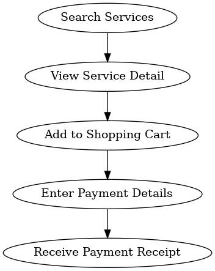

# Service Flow – Eleutherios MVP

This document describes the end-to-end **Service Flow** in Eleutherios, aligned with the UX designs and payment model.

---

## Overview
The Service Flow enables a user (homeless person, policymaker, organisation, or service provider) to:
1. Discover services linked to policies.
2. Inspect service details.
3. Add services to a cart (single or multiple).
4. Choose free/paid options and process payments.
5. Receive confirmation/receipt.

---

## Flow Diagram

---

## Step Breakdown

### 1. Service Search
- User searches for services by policy, category, or location.
- Results show service name, description, and policy linkage.
- Entry point into the ecosystem.

### 2. Service Detail
- Full view of service metadata: owner, description, policy links.
- Linked forums instantiated from rules.
- User can **join**, **consume policy**, or **trigger service**.

### 3. Shopping Cart
- Supports **multiple services from different providers**.
- Handles **Stripe**, **PayPal**, and **free toggle**.
- Services can be analogue (human) or digital (API/AI/IoT).

### 4. Payment Details
- Secure entry of payment credentials.
- Stripe Connect supported (merchant accounts).
- Extendable to federated payment gateways.

### 5. Payment Receipt
- Confirmation screen with:
  - Service(s) purchased
  - Amount paid or “Free”
  - Policy/Forum links
  - Reference ID for records

---

## Developer Notes
- Payment integration should start with **Stripe Connect**.
- Future support for PayPal, global banking APIs, and subscription billing.
- Free services must skip the payment gateway but still log the transaction.
- Firestore schema references:
  - `Services`
  - `Policies`
  - `Forums`
  - `Transactions`
- Logs interactions for analytics and reporting.

---

**Status:** Core MVP feature – must be implemented to demonstrate **governance + service + economic transaction loop**.
